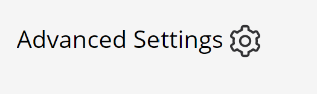
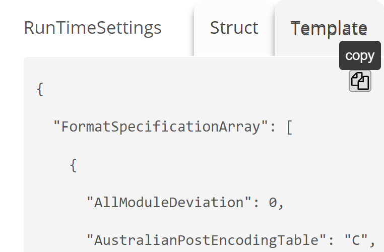

# How can I enable QR Code Model 1 support in BarcodeScannerX?

[<< Back to FAQ index](index.md)

Most QR codes today follow the **QR Code Model 2** standard. By default, **BarcodeScannerX** only supports QR Code Model 2. If you want to test **QR Code Model 1**, follow the steps below for either **Android** or **iOS**:

---

## 🔧 Steps to Enable QR Code Model 1

1. Visit the [Dynamsoft Barcode Reader Online Demo](https://demo.dynamsoft.com/barcode-reader/){:target="_blank"}.
2. Click **Advanced Settings**.

   

      

   

3. In the settings, check the option **EnableQRCodeModel1** (you can modify any other settings as well).
4. Click **Save Template**.

   

      

   

5. Send your saved template to the [Dynamsoft Support Team](https://www.dynamsoft.com/contact/?ver=latest){:target="_blank"}.
6. Our team will generate and send you a unique link for the configuration.
7. In the **Advanced Scan Settings** of BarcodeScannerX (on Android or iOS), tap **Import Template** and paste the link.
8. You’re now ready to scan **QR Code Model 1**!

---

If you run into any issues during setup or scanning, feel free to reach out to the Dynamsoft support team.